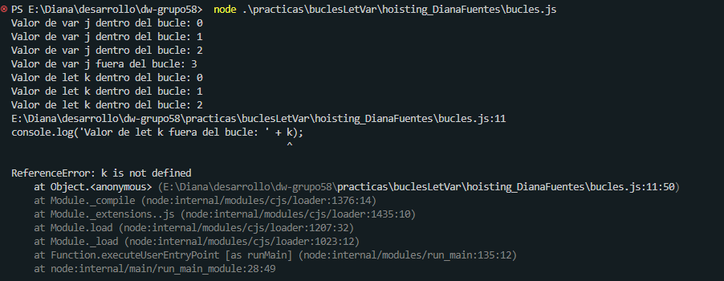

1. El valor de "J" fuera del bucle es 3, porque se uso la palabra reservada **VAR**, lo que nos dice que el valor de j
esta en un ámbito global y por ende existe fuera del ciclo for. 

2. El valor de "K" fuera del bucle no esta definido y marca error, porque se uso la palabra reservada **LET**, lo que 
nos dice que el valor de k esta en un ámbito de bloque, es decir esta limitado al bloque, declaración o expresión donde 
se esta usando, o lo que significa que k solo existe dentro del ciclo for. 

