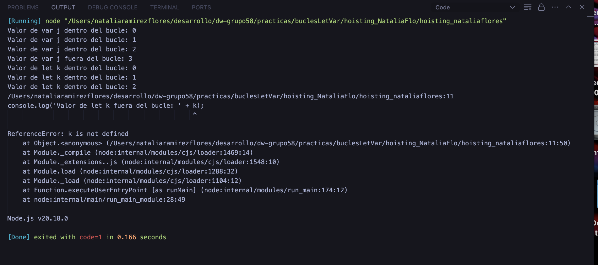

## Preguntas

1. ¿Cuál será el resultado del primer console.log fuera del primer bucle (variable j)?
**Respuesta:** El resultado del primer console.log (variable j), el valor de j será 3, porque var tiene alcance fuera del bucle.

---------------

2. ¿Qué va a ocurrir en el segundo console.lgo fuera del segundo bucle (variable k)?
**Respuesta:** El resultado del segundo console.log dará un ReferenceError porque k (declarada con let) no existe fuera del bucle.

**Ejercicio ejecutado:**
 

