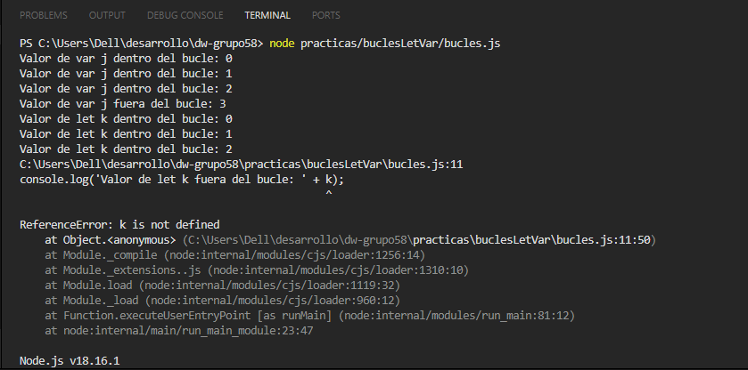

## Respuestas Karina Esparza

* **1. ¿Cuál será el resultado del primer console.log fuera del primer bucle (variable j)?**
**R->** El resultado del primer console.log fuera del primer bucle (variable j) nos imprime un número 3, ya que se solicita sumar +1 al último valor de j, en este caso 2 + 1 = 3. Esto es posible al ser j una variable de tipo var, es decir se puede usar tanto dentro como fuera de la función.

* **2. ¿Qué va a ocurrir en el segundo console.log fuera del segundo bucle (variable k)?**
**R->** En este caso como la variable let es de alcance tipo bloque no se puede utilizar fuera del bloque de la función, por lo tanto al querer sumar +1 como en la variable j, no es posible ya que no identifica dicha variable. Por lo tanto arroja un error.

