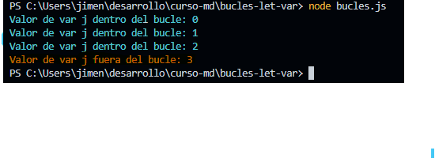
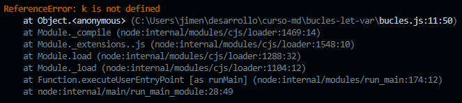

# 1. ¿Cuál será el resultado del primer console.log fuera del primer bucle (variable j)?
### Primer punto:
La variable `j` es declarada con `var`, por lo que su alcance (scope) es principalmente global.
- **Alcance global**: `var` fuera de una o varias funciones, cualquier parte del código puede acceder a la variable.
las variables `var` dependiendo su ambito tienen alcance de función:
- **Alcance de función**: cuando se declara una variable con `var` dentro de una función, su alcance está limitado a esa función. Esto significa que solo se puede acceder a la variable dentro de la función donde se declaró.


### Segundo punto (Hoisting):
En **hoisting**, al usar `var`, la declaración de la variable se eleva a la parte superior del ámbito. Sin embargo, solo la declaración (`var j`) se eleva, no la inicialización (`j = 1`) por eso el undefined.

#### Ejemplo 1 - Asi funciona el hoisting:
```javascript
var a; // Declaración elevada (hoisting) es undefined
console.log(a); // undefined
a = 5; // Inicialización
console.log(a); // 5 
```

#### Ejemplo 2:
```javascript
console.log(a); // undefined -  se declara pero no se inicializa, esto seria:  'var a;'
var a = 5;
console.log(a); // 5
```

#### Ejemplo 3 - Asi funciona el hoisting:
```javascript
var j; // Declaración elevada (hoisting) es undefined
j = 0; // Inicialización

for (j = 0; j < 3; j++) {
    console.log('Valor de var j dentro del bucle: ' + j);
}
console.log('Valor de var j fuera del bucle: ' + j);
```

#### Ejemplo 4:
```javascript
console.log(j) // undefined - Declaración elevada (hoisting), aunque j ha sido declarada debido el hoisting, su inicialización no se ha realizado todavia, esto seria: 'var j';
for ( var j = 0; j < 3; j++) {
    console.log('Valor de var j dentro del bucle: ' + j);
}
console.log('Valor de var j fuera del bucle: ' + j);
```

### Respuesta: 
Al finalizar el bucle for `j` tendrá un valor de `3` ya que es el valor final del bucle, es decir... `j` será incrementado hasta que deja de ser menor a `3`.

### Explicación:
```javascript
for ( var j = 0; j < 3; j++) {
    console.log('Valor de var j dentro del bucle: ' + j);
}

console.log('Valor de var j fuera del bucle: ' + j);
```

|  Ciclo o Bucle    | Valor de `j` (este se imprime) | `j < 3` (true o false) | `j + 1` = ?  j despues del bucle |
|-------------------|--------------------------------|------------------------|----------------------------------|
| 1                 | `0`                            | 0 < 3 = true           | 0 + 1 = 1                        |
| 2                 | `1`                            | 1 < 3 = true           | 1 + 1 = 2                        |
| **3**             | **`2`** valor dentro del bucle | **2 < 3 = true**       | **2 + 1 = 3**                   |  
| 4                 | `3`  valor fuera del bucle     |   3 < 3 = false        | -                                |



==========================================================================================================


# 2. ¿Qué va a ocurrir en el segundo console.log fuera del segundo bucle (variable k)?
### Primer punto:
La variable `k` es declarada con `let`, lo que significa que su alcance (scope) es de bloque. Esto implica que `k` solo es accesible dentro del bloque delimitado por llaves {}, en el que fue declarada. Un bloque puede ser parte de estructuras de control como:
- Funciones
- Bucles (for, wgile)
- Sentencias condicionales (if, else)
- Cualquier otra estructura de control que use llaves {}.
Fuera de ese bloque, `k` no estará disponible y cualquier intento de acceder a ella resultará en un ReferenceError.

### Segundo punto:
En **hoisting**, al usar `let` la declaración también se eleva, pero la variable no se inicializa hasta que se alcanza la línea de código donde se declara. Esto quiere decir que `si se intenta usar la variable` `let` `antes de declararla, se obtendra un ReferenceError ya que se encuentra en zona muerta temporal (o Temporal Dead Zone "TDZ" ` 

#### TDZ - zona muerta temporal: 
Período en el que las variables let y const aún no han sido declaradas y cualquier intento de acceder a ellas resultará en un error.

#### Ejemplo 1 - Asi funciona el hoisting :
```javascript
let a; // Declaración elevada (hoisting), pero no inicializada- ESTÁ EN ZONA MUERTA TEMPORAL
console.log(a); // ReferenceError: Cannot access 'a' before initialization
a = 5; // Inicialización
console.log(a); // 5
```

#### Ejemplo 2:
```javascript
console.log(a); //ReferenceError: Cannot access 'a' before initialization - ESTÁ EN ZONA MUERTA TEMPORAL
let a = 5; // Declaración e inicialización
console.log(a); // 5
```

#### Ejemplo 3 - Asi funciona el hoisting:
```javascript
let k; // Declaración elevada (hoisting), pero no inicializada - ESTÁ EN ZONA MUERTA TEMPORAL
for (k = 0; k < 3; k++) { //inicialización
    console.log('Valor de let k dentro del bucle: ' + k);
}
console.log('Valor de let k fuera del bucle: ' + k);  //3, porqué k si está declarada fuera del for y es accesible
```

#### Ejemplo 4:
```javascript
console.log(k); // Declarada pero no inicializada, ReferenceError: Cannot access 'k' before initialization - ESTÁ EN ZONA MUERTA TEMPORAL
for (let k = 0; k< 3; k++) {
    console.log('Valor de let k dentro del bucle: ' + k);
}
console.log('Valor de let k fuera del bucle: ' + k); // ReferenceError: k is not defined
```

### Respuesta: 
La variable `k` es declarada y inicializada dentro del bucle con `let`, lo que significa que su alcance (scope) es limitado a ese bloque del bucle y no está accesible por fuera.

### Explicación:
```javascript
for (let k = 0; k < 3; k++) {
    console.log('Valor de let k dentro del bucle: ' + k);
}

console.log('Valor de let k fuera del bucle: ' + k);
```
|  Ciclo o Bucle    | Valor de `k` (este se imprime) | `k < 3` (true o false) | `k + 1` = ?  k despues del bucle |
|-------------------|--------------------------------|------------------------|----------------------------------|
| 1                 | `0`                            | 0 < 3 = true           | 0 + 1 = 1                        |
| 2                 | `1`                            | 1 < 3 = true           | 1 + 1 = 2                        |
| **3**             | **`2`** valor dentro del bucle | **2 < 3 = true**       | **2 + 1 = 3**                   |  
| 4                 | `3`                            |   3 < 3 = false        | -                                |

Cuando intentamos acceder a k fuera del bucle, obtendremos un Error de Referencia (ReferenceError) porque k no está definida en ese contexto (o sea fuera del bucle). Esto se debe a que, al usar let, la variable k tiene un alcance de bloque. 
Fuera del bucle, k se encuentra en lo que se conoce como zona muerta temporal, lo que significa que no se puede acceder a ella y, por lo tanto, el código lanzará el error ReferenceError: k is not defined.




